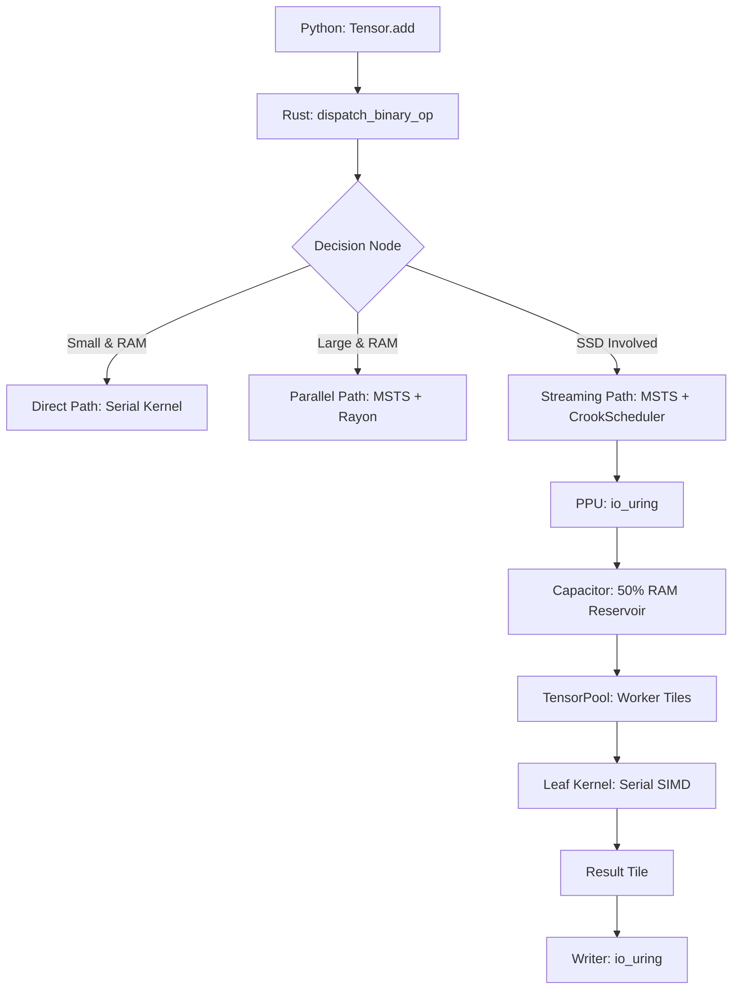

# OxTorch Unified Architecture (NEW)

This document describes the **Final Unified Architecture** of the OxTorch core. It follows the "MERA-Style" philosophy of decoupling I/O, storage management, and computation into a single, high-performance pipeline.

---

## 1. The Unified High-Level Pipeline

In the new architecture, there is only ONE entry point for all CPU operations. The system no longer distinguishes between SSD and RAM at the user API level.

## 2. Component Roles

### A. Capacitor (The Reservoir)
- **Status**: Allocated as 50% of available system RAM.
- **Role**: The landing zone for all SSD I/O. It uses `O_DIRECT` and `io_uring` to perform zero-copy DMA from the NVMe controller.
- **Benefit**: Its massive size (up to 50% RAM) allows for extremely aggressive prefetching, making the SSD feel as fast as RAM for sequential workloads.

### B. TensorPool (The Working Bins)
- **Status**: Thread-local slab allocator.
- **Role**: Provides the physical buffers (Tiles) for the kernels. 
- **Integration**: MSTS requests tiles from the pool, which are then filled from the Capacitor or RAM source.
- **Benefit**: Eliminates `malloc`/`free` overhead. Memory is recycled, keeping the RAM footprint constant.

### C. MSTS (The Brain)
- **Role**: The master orchestrator. It decides the tiling strategy based on hardware parameters (L1/L2/L3 cache sizes) and tensor location.
- **Unification**: It manages the `CrookScheduler` which coordinates the **Reader** (Pump), **Compute** (Engine), and **Writer** (Flush) threads.

### D. Leaf Kernels (The Bricks)
- **Role**: Pure, serial SIMD functions (e.g., `add_bf16_avx_serial`).
- **Constraint**: **NEVER** use internal threading (no nested Rayon).
- **Benefit**: This allows the MSTS Orchestrator to decide exactly where to execute them (main thread, Rayon pool, or I/O worker) without resource contention.

---

## 3. Data Flow: The "Jerry Can" Analogy

1.  **Dysk (Source)**: The distant quarry.
2.  **Capacitor**: The huge reservoir next to the building site (50% RAM). **io_uring** is the high-speed pipeline filling it.
3.  **TensorPool**: The standardized jerry cans (Tiles).
4.  **MSTS**: The logistics manager filling jerry cans from the reservoir and handing them to the builders.
5.  **Leaf Kernels**: The builders. They only know how to empty a jerry can (Compute) and fill a new one (Result).

This architecture ensures that the **Builders (CPU)** are never waiting for the **Pipes (SSD)**, thanks to the **Reservoir (Capacitor)**.
