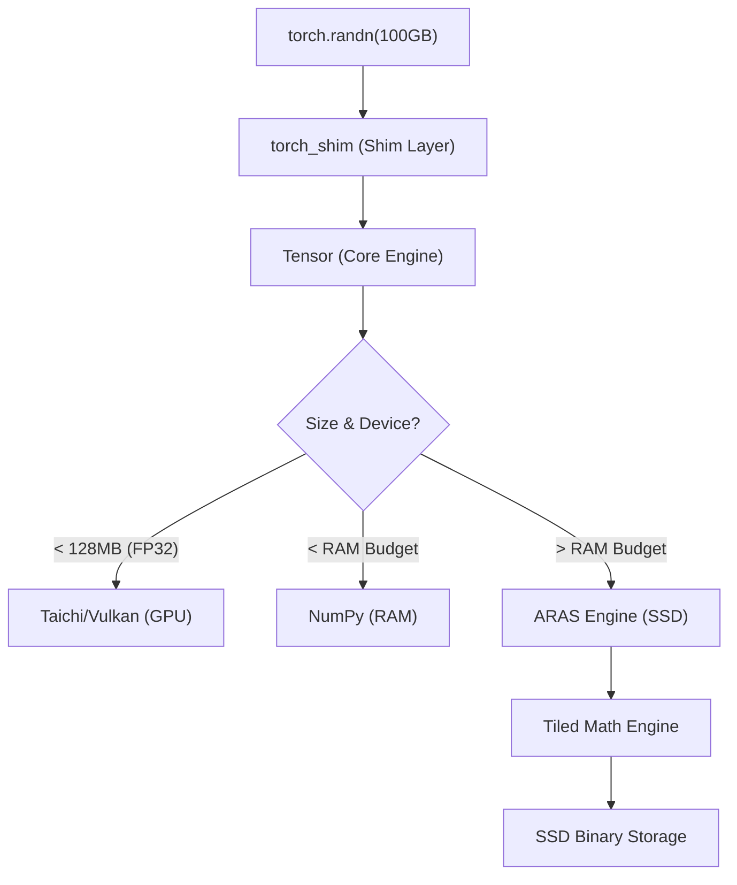

# Architecture: The VNN Bridge Strategy

VulkanNN (VNN) Legacy Edition is built on a unique architectural premise: **Software-Defined Memory Hierarchy**. Unlike PyTorch, which assumes your model fits in VRAM or RAM, VNN assumes you have an old GPU and limited RAM, but an extremely fast SSD.

## 1. The Multi-Tiered Backend
VNN automatically routes every operation through the most efficient backend based on the current system load:

### A. Vulkan (via Taichi)
*   **Target**: Small to medium tensors (under 128MB).
*   **Benefit**: Extremely low latency, full GPU acceleration.
*   **Limitation**: Limited by physical VRAM. 

### B. NumPy (CPU/RAM)
*   **Target**: General-purpose tensors that fit in available system memory.
*   **Benefit**: High-speed CPU processing (AVX/SIMD), zero-copy indexing.
*   **Limitation**: Limited by system RAM capacity.

### C. ARAS (SSD Streaming)
*   **Target**: "Monster Scale" tensors (Gemma weights, enormous activations, gradients).
*   **Benefit**: OOM-safety. Can process models of arbitrary size (100GB+) as long as there is disk space.
*   **Innovation**: **Adaptive RAM-Aware Streaming**. Instead of simple memmap, it uses a "Greedy Factory" and "RAM-First Caching" to bypass OS bottlenecks (like ZFS ARC limits). Now supports **Tiled Reductions** (SSD-native `sum`/`mean`).

## 2. Autograd & Unified Gradient Accumulation
VNN's reverse-mode differentiation engine is designed to be backend-agnostic. The core innovation is the `_acc_grad(grad)` method, which routes gradient accumulation based on the device:

- **SSD**: Uses the ARAS engine for tiled, multi-threaded element-wise addition.
- **Vulkan**: Uses Taichi kernels (`k_add`) for GPU-accelerated accumulation.
- **CPU**: Uses NumPy for numerical stability.

This ensures that even if you have a 40GB gradient buffer on an 8GB RAM system, the accumulation never triggers an OOM.

## 3. Zero-Copy Loading
One of VNN's primary advantages over PyTorch is the `from_binary` (and `external_path`) mechanism. While PyTorch's `torch.load` usually requires loading the entire model into RAM before initializing, VNN **mounts** the binary files.

- **VNN**: Points to the file on disk. RAM usage is near zero until an operation starts.
- **PyTorch**: Reads file, populates RAM, potentially triggers OOM.

## 4. Compute Kernels & Taichi Backend
All heavy lifting is done by **Taichi kernels**, which are JIT-compiled to SPIR-V (Vulkan compute shaders).
- **Design**: Kernels operate on 1D flattened arrays to simplify shader code.
- **Parallelization**: Automatically handled by Taichi.
- **Precision**: Currently optimized for FP32 with expanding support for FP16 and INT8.

## 5. Hardware Calibration & Tuning
Since VNN treats **VRAM/RAM as a Cache**, performance depends on finding the "Sweet Spot" for your hardware.

### The "Fast BAR" Threshold
Most GPUs have a Visible VRAM BAR (usually 256MB). 
- **Optimization**: Set your optimizer `tile_size` so that state buffers fit into this 256MB window for full-speed CPU access.

### Recommendation Table (Backpropagation)
| GPU Tier | VRAM | Strategy | SSD Speed Target |
| :--- | :---: | :--- | :--- |
| **Legacy** | 1-2GB | SSD-Native | ~500MB/s (SATA) |
| **Mid-Range** | 8GB | Hybrid Buffer | ~2GB/s (NVMe Gen3) |
| **High-End** | 24GB | VRAM-Cached | ~7GB/s (NVMe Gen4) |
