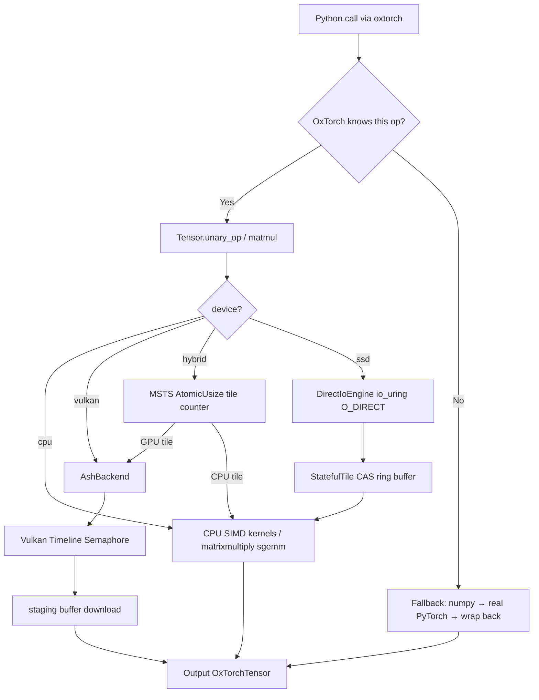

# OxTorch Architecture: The MERA-400 Legacy

OxTorch (project dir: `vulkannn_rusted`) is built on the philosophy of **asynchronous, deterministic dataflow**. Inspired by the MERA-400 minicomputer, the engine treats hardware as a collection of asynchronous processing units that pull work from a unified stream.

---

## 1. Source Map (`.rs` files)

### Module Entry & API
- **`src/lib.rs`**: Root of the crate. Defines the PyO3 `#[pymodule]` and exposes `Tensor`, `DataType` to Python as `import vulkannn_rusted`.
- **`src/tensor/mod.rs`**: Defines the `Tensor` struct — main user handle. Manages shape, device, dtype metadata.

### Tensor Orchestration
- **`src/tensor/linalg.rs`**: High-level linear algebra dispatcher. Routes MatMul and BitLinear to CPU or GPU.
- **`src/tensor/constructors.rs`**: Tensor creation from memory, SSD, zeros, random data. BitNet ternary quantization logic.
- **`src/tensor/storage.rs`**: Tri-Precision backbone. Defines how F32, F16, BF16, Int8, and Ternary data are stored in raw byte vectors.
- **`src/tensor/access.rs`**: Raw memory access, slicing, zero-copy views. Handles SSD tensor data traversal.
- **`src/tensor/ops.rs`**: Dispatcher for elementwise operations (Add, Mul, Sub, scalar ops).
- **`src/tensor/reductions.rs`**: Dispatcher for Sum, Mean, Max, Softmax.
- **`src/tensor/msts.rs`**: MSTS (Mera Style Tiling System) — 3-path dispatch for SSD-resident tensors. Path A (direct), B (single-thread), C (full CrookScheduler).
- **`src/tensor/types.rs`**: `DataType` enum (F32, F16, BF16, Int8, Ternary).
- **`src/tensor/pool.rs`**: Thread-local slab allocator (`TensorPool`) — 6-bucket pool for zero-copy buffer reuse.

### CPU Backend (`src/cpu/`)
- **`src/cpu/mod.rs`**: Entry point; re-exports ops and SIMD conversions.
- **`src/cpu/conversions.rs`**: F16/BF16 ↔ F32 conversion via F16C/SSE2/NEON/scalar dispatch.
- **`src/cpu/tiling_cpu.rs`**: Helpers for dividing large matrices into cache-friendly tiles.
- **`src/cpu/ops/matmul/`**: `f32.rs`, `f16.rs`, `bf16.rs`, `i8.rs` — precision-specific SIMD MatMul.
- **`src/cpu/ops/unary/`**: `relu/`, `gelu/`, `sigmoid/`, `silu/`, `softmax/` — per-dtype activation kernels. Each dtype has its own file (e.g., `gelu_i8.rs`, `relu_f16.rs`).
- **`src/cpu/ops/reduction/softmax/`**: Softmax; `softmax_i8.rs` uses dequantized F32 computation.
- **`src/cpu/ops/binary/`**: Element-wise binary ops (mul, sub, div, scalar).
- **`src/cpu/ops/bit_linear.rs`**: Rayon-parallelized BitNet 1.58b linear kernel.

### Vulkan Backend
- **`src/backend.rs`**: Heart of the GPU engine. Raw Vulkan 1.2 via `ash`. Manages command pools, pipelines, descriptor sets, buffer cache, and timeline semaphore.

### SSD & Streaming
- **`src/streaming.rs`**: RAM budget detection, prefetcher init, background SSD read thread.
- **`src/io_uring_engine.rs`**: Linux `io_uring` + `O_DIRECT` for direct DMA reads without page cache.
- **`src/crook_scheduler.rs`**: Asynchronous Work-Stealing Queue. `StatefulTile` ring buffer; CAS-based tile state transitions.

### Utilities
- **`src/buf_pool.rs`**: Non-blocking Vulkan buffer recycler.
- **`src/prng.rs`**: Thread-safe RNG (Xoshiro256++).

---

## 2. Python Layer (`oxtorch/`)

The `oxtorch` Python package is a **transparent PyTorch drop-in**. It lives inside `vulkannn_rusted/oxtorch/` and is **completely separate** from the compiled Rust extension.

```
vulkannn_rusted/oxtorch/__init__.py   ← module-level dispatcher + fallback
vulkannn_rusted/oxtorch/tensor.py     ← OxTorchTensor proxy class
```

```
import oxtorch as torch
       │
       ▼
  oxtorch/__init__.py
       │
       ├── op natively in vulkannn_rusted? ──► Rust kernel (Vulkan/CPU SIMD)
       │
       └── not implemented? ─────────────────► __getattr__ fallback:
                                               tensor → numpy → real torch → back
```

**Why the names are different:** `oxtorch` is the user-facing Python package; `vulkannn_rusted` is the compiled Rust extension it uses internally. Keeping them distinct prevents naming collisions when doing `import oxtorch as torch` (which would otherwise shadow the folder itself).

---

## 3. Vulkan Backend (`src/backend.rs`)

The `AshBackend` singleton (held in `OnceLock`) contains:
- Physical and logical Vulkan device
- Separate compute and transfer command pools
- Pre-built descriptor set pools and pipelines (matmul, relu, sigmoid, silu, gelu, elementwise, softmax, bit_linear)
- `timeline_semaphore` for async operation tracking
- `pending_ops: Mutex<Vec<AsyncOp>>` — tracks in-flight GPU work
- `buffer_cache: Mutex<Vec<CachedBuffer>>` — pool of recycled GPU buffers
- `pool_buffer` — 1GB dedicated VRAM pool for device buffers

Shaders are WGSL/GLSL sources compiled to SPIR-V at build time by `naga` in `build.rs`.

### Pipeline Execution Flow

1. Acquire input/output device buffers from cache (or allocate from pool)
2. Acquire CPU-visible staging buffers
3. Upload: copy bytes to staging, then `cmd_copy_buffer` staging → device buffer
4. Pipeline barrier: `TRANSFER_WRITE` → `SHADER_READ`
5. Bind descriptor set, dispatch compute shader
6. Pipeline barrier: `SHADER_WRITE` → `TRANSFER_READ`
7. `cmd_copy_buffer` device buffer → staging
8. Submit to compute queue, signal Timeline Semaphore
9. After semaphore wait: `download_from_stage` copies staging bytes to output

---

## 4. MSTS Tile-Pulling Hybrid Dispatch

Source: `src/tensor/mod.rs` (unary_op hybrid branch), `src/crook_scheduler.rs`

Inspired by the MERA-400's clockless asynchronous architecture, MSTS eliminates static CPU/GPU work splits.

### In-Memory Tile Pulling (activations, device="hybrid")

```
total_elements → N tiles of 256K elements each
tile_counter = Arc<AtomicUsize>(0)

Rayon scope:
  [GPU dispatcher]:  loop { tile_id = tile_counter.fetch_add(1); dispatch to Vulkan }
  [CPU SIMD thread]: loop { tile_id = tile_counter.fetch_add(1); compute with SIMD }
```

Each thread independently claims the next tile. No locks. No predetermined split.

**GPU threshold**: if `num_elements < 4_194_304` (4M = ~16MB F32), the GPU dispatcher is not spawned. Bonaire PCIe round-trip overhead (~80ms) makes Vulkan uncompetitive on small tensors.

### SSD Streaming (device="ssd") — 3-Path Dispatch (v3.7.1+)

A ring of `AlignedBuffer`-backed `StatefulTile` structures drives disk-to-RAM streaming. Selection is automatic:

| Path | Condition | IO Threads | Compute Mode |
|:---|:---|:---:|:---|
| **A — Direct** | `< MSTS_DIRECT_MAX` (≈3 MB) | 0 | Single AVX thread, full mmap |
| **B — Single-thread** | `< 32 MB` | 1 | Inline, L2-resident tile |
| **C — Full CrookScheduler** | `≥ 32 MB` | 2 | `rayon` parallel + CAS ring |

The `TensorPool` slab allocator recycles tile buffers between ops — no per-tile allocation in the hot path.

Each tile transitions atomically:

```
EMPTY → LOADING → READY_FOR_COMPUTE → COMPUTING → READY_FOR_WRITE → EMPTY
```

`io_uring` threads fill tiles from disk while compute workers consume them. All transitions are Compare-And-Swap — no mutex in the hot path.

---

## 5. SIMD Conversion Dispatch

Source: `src/cpu/conversions.rs`

| Condition | F16↔F32 | BF16↔F32 |
|:---|:---|:---|
| x86_64 + F16C + AVX | F16C intrinsics (`_mm256_cvtps_ph`) | SSE2 round-to-nearest-even |
| x86_64 + SSE2 only | SWAR branchless bit-manipulation | SSE2 round-to-nearest-even |
| AArch64 | NEON `vcvt_f16_f32` | NEON shift trick |
| Other | Rayon scalar (`from_f32` / `to_f32`) | Rayon scalar |

Runtime dispatch via `is_x86_feature_detected!()` — no compile-time flags needed.

The i5-3450 (Ivy Bridge) has both AVX and F16C → fastest x86_64 path for F16, SSE2 for BF16 (no AVX2).

---

## 6. SSD Streaming (io_uring + O_DIRECT)

Source: `src/io_uring_engine.rs`

`DirectIoEngine` wraps a Linux `io_uring` instance with `O_DIRECT` file access. Bypasses the kernel VFS page cache entirely, streaming at the disk controller's DMA rate into user-space buffers aligned to 1MB ZFS recordsize boundaries. No page faults, no kernel-to-user copies.

For the 16GB Monster ReLU benchmark: ~46.6s for 4B F32 elements at ~86MB/s effective throughput.

---

## 7. Data Flow Diagram



---

## 8. Benchmark Suite

The primary benchmark system is the **Atomized Suite** in `tests/benchmarks/`. Each benchmark is a self-contained Python script testing one op/dtype/backend combination.

```bash
PYTHONPATH=/path/to/vulkannn_rusted python tests/run_all_benchmarks.py
```

See [how_we_test.md](how_we_test.md) for a full description.
