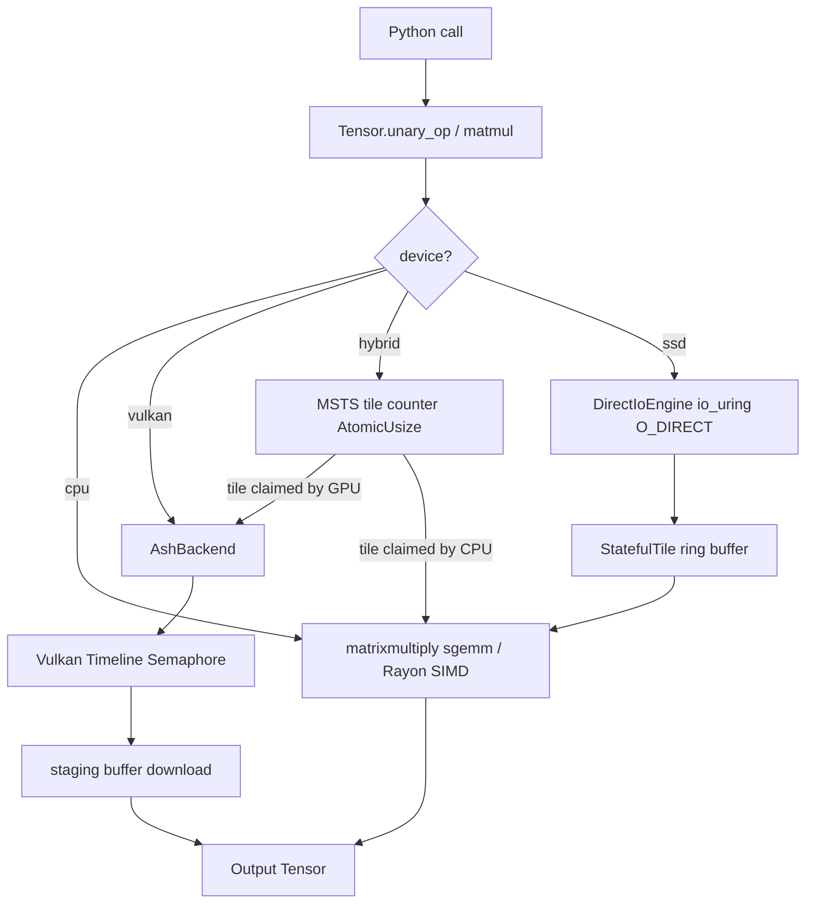

# OxTorch Architecture: The MERA-400 Legacy

OxTorch (formerly VulkanNN Rusted) is built on the philosophy of **asynchronous, deterministic dataflow**. Inspired by the MERA-400 minicomputer, the engine treats hardware as a collection of asynchronous processing units that pull work from a unified stream.

## 🧱 Core Source Map (.rs file overview)

Marek requested a detailed breakdown of every source file in the engine:

### 🚀 Module Entry & API
- **`src/lib.rs`**: The root of the crate. Defines the PyO3 module and exposes `Tensor`, `DataType`, and other types to Python.
- **`src/tensor/mod.rs`**: Defines the `Tensor` struct. This is the main handle for all user operations. It manages shape, device, and metadata.

### 🧠 Tensor Orchestration
- **`src/tensor/linalg.rs`**: High-level linear algebra dispatcher. It decides whether to run a MatMul or BitLinear on the CPU or GPU based on the tensor's `device` property.
- **`src/tensor/constructors.rs`**: Logic for initializing tensors from memory (`new_from_vec`), zeros, or random data. Includes the **BitNet quantization logic** (Ternary conversion).
- **`src/tensor/storage.rs`**: The backbone of Tri-Precision. It defines how F32, F16, BF16, Int8, and Ternary data are stored in raw byte vectors.
- **`src/tensor/access.rs`**: Methods for raw memory access, slicing, and zero-copy views.
- **`src/tensor/ops.rs`**: Dispatcher for elementwise operations (Add, Mul, Sub).
- **`src/tensor/reductions.rs`**: Dispatcher for Sum, Mean, Max, and Softmax.

### ⚡ CPU Backend (`src/cpu/`)
- **`src/cpu/mod.rs`**: entry point for CPU-side execution.
- **`src/cpu/ops/bit_linear.rs`**: Pure Rust, Rayon-parallelized implementation of the BitNet linear kernel.
- **`src/cpu/ops/matmul/`**:
    - `f32.rs`, `f16.rs`, `bf16.rs`: Specialized SIMD implementations for each precision.
    - `f16.rs` includes runtime detection of **F16C** and **AVX** features for high-speed half-precision compute.
- **`src/cpu/ops/relu/`**: Optimized activation kernels using AVX/NEON/SWAR.
- **`src/cpu/elementwise.rs`**: Parallel elementwise kernels.

### 🎮 Vulkan Backend (`src/backend.rs`)
- **`src/backend.rs`**: The heart of the GPU engine. Uses the `ash` crate for raw Vulkan control. Manages command pools, pipeline layouts, descriptor sets, and the ASH-to-SPIR-V execution flow.

### 💿 SSD & Streaming (MERA-System)
- **`src/streaming.rs`**: Prefetching and budget management for out-of-core models.
- **`src/tensor/msts.rs`**: "Mera Style Tiling System". The logic that allows a tensor to reside on an SSD and be processed tile-by-tile.
- **`src/io_uring_engine.rs`**: High-performance Linux I/O using `io_uring` and `O_DIRECT`.

### ⛓ Scheduler & Utilities
- **`src/crook_scheduler.rs`**: The "Asynchronous Work-Stealing Queue". It prevents the CPU from waiting for the GPU by letting them pull work tiles independently.
- **`src/buf_pool.rs`**: A non-blocking Vulkan buffer recycler to minimize allocation latency.
- **`src/swar_int8.rs`**: "SIMD Within A Register" logic for 8-bit integer math on CPUs that lack native 8-bit SIMD support.
- **`src/tiling_cpu.rs`**: Helpers for dividing large matrices into cache-friendly CPU tiles.
- **`src/prng.rs`**: Thread-safe random number generator for `randn()` etc.

---

## 2. Vulkan Backend (Raw ash, Vulkan 1.2)

Source: `src/backend.rs`

The GPU backend was rewritten in v3.7.0 (The BitNet Leapfrog)),
providing explicit control over every GPU resource.

The `AshBackend` singleton (held in `OnceLock`) contains:
- Physical and logical Vulkan device
- Separate compute and transfer command pools
- Pre-built descriptor set layouts and compute pipelines (add, matmul, relu, sigmoid, silu)
- A `timeline_semaphore` for async operation tracking
- `pending_ops: Mutex<Vec<AsyncOp>>` — tracks in-flight GPU work for staged cleanup
- `buffer_cache: Mutex<Vec<CachedBuffer>>` — recycles GPU buffers to avoid per-dispatch allocation

Shaders are WGSL sources compiled to SPIR-V at build time by `naga` in `build.rs`.

### Pipeline Execution Flow (single op)

1. Acquire input/output buffers from cache (or allocate)
2. Acquire CPU-visible staging buffers
3. Upload: copy input bytes to staging, then `cmd_copy_buffer` staging -> device buffer
4. Pipeline barrier: `TRANSFER_WRITE` -> `SHADER_READ`
5. Bind descriptor set, dispatch compute shader
6. Pipeline barrier: `SHADER_WRITE` -> `TRANSFER_READ`
7. `cmd_copy_buffer` device buffer -> staging out
8. Submit to compute queue; for async path: signal timeline semaphore
9. After semaphore wait: `download_from_stage` copies staging bytes to output

---

## 3. MSTS Tile-Pulling Hybrid Dispatch

Source: `src/tensor/mod.rs` (unary_op hybrid branch), `src/crook_scheduler.rs`

Inspired by the MERA-400's clockless asynchronous architecture and the Tagged-Token Dataflow
model of the CROOK OS, the MSTS dispatcher eliminates static CPU/GPU work splits.

### Activation Tile-Pulling (Phase 4)

For `device="hybrid"` activation functions:

```
total_elements -> N tiles of 256K elements each
tile_counter = Arc<AtomicUsize>(0)

Rayon scope:
  [GPU dispatcher thread]:  loop { tile_id = tile_counter.fetch_add(1); dispatch to Vulkan }
  [CPU SWAR thread]:        loop { tile_id = tile_counter.fetch_add(1); compute with SIMD }
```

Each thread independently claims the next unclaimed tile. There is no negotiation, no lock,
and no predetermined split. Whichever resource finishes faster claims more work.

**GPU threshold**: if `num_elements < 4_194_304` (4M = ~16MB F32), the GPU dispatcher thread
is not spawned. Bonaire PCIe round-trip overhead (~80ms) makes Vulkan uncompetitive on small
tensors.

### StatefulTile Ring Buffer (SSD streaming)

Source: `src/crook_scheduler.rs`

A ring of 1MB-aligned `StatefulTile` structures drives SSD-to-RAM streaming for out-of-core
tensors. Each tile transitions atomically through states:

```
EMPTY -> LOADING -> READY_CPU -> READY_GPU -> GPU_COMPUTING -> GPU_DONE -> EMPTY
```

Separate io_uring threads fill tiles from disk while CPU/GPU workers consume them.
No mutex is used in the hot path; all transitions are Compare-And-Swap.

---

## 4. SIMD Conversion Dispatch

Source: `src/cpu/conversions.rs`

All F16/BF16 <-> F32 conversion is handled by one of four paths, selected at runtime:

| Condition | F16<->F32 | BF16<->F32 |
|:---|:---|:---|
| x86_64 + F16C + AVX | `_mm256_cvtps_ph` / `_mm256_cvtph_ps` | SSE2 round-to-nearest-even |
| x86_64 + SSE2 only | SWAR branchless bit-manipulation | SSE2 round-to-nearest-even |
| AArch64 | NEON `vcvt_f16_f32` / `vcvt_f32_f16` | NEON shift trick |
| Other | Rayon scalar `from_f32` / `to_f32` | Rayon scalar |

The i5-3450 (Ivy Bridge) has both AVX and F16C, so it uses the fastest x86_64 path
for F16 and the SSE2 path for BF16 (AVX2 not available on Ivy Bridge).

---

## 5. SSD Streaming (io_uring + O_DIRECT)

Source: `src/io_uring_engine.rs`

`DirectIoEngine` wraps a Linux `io_uring` instance with `O_DIRECT` file access.
This bypasses the kernel VFS page cache entirely, streaming data at the disk controller's
DMA rate directly into user-space buffers aligned to 1MB ZFS recordsize boundaries.
No page faults, no kernel-to-user copies.

For the 16GB Monster ReLU benchmark: ~46.6 seconds for 4 billion F32 elements at ~86MB/s
effective throughput from the ZFS pool.

---

## 6. Data Flow Diagram



---

## 7. Statistical Benchmark Harness

Source: `tests/unified_benchmark.py`

Multi-run audit with per-test tracking of Median, Mean, StdDev, and OxTorch/PyTorch ratio.
Results are written to `tests/last_results.json` (history of all runs) and
`tests/benchmark_history.log` (human-readable log).

Parity checking uses `numpy.testing.assert_allclose` with precision-appropriate tolerances:
- F32: `atol=1e-4`
- F16: `atol=0.1`
- BF16: `atol=1.0` (7-bit mantissa accumulation error on 2k MatMul)
