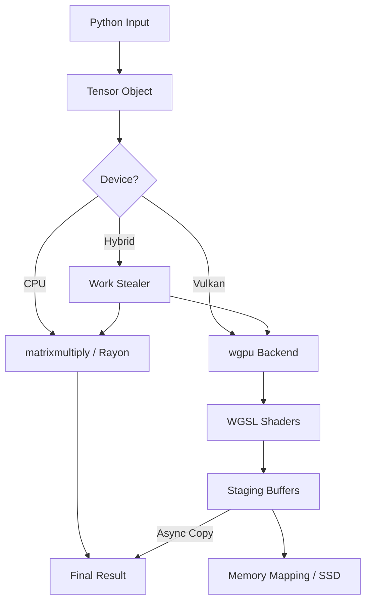

# 🏗 Architecture Deep-Dive (v2.9.0)

VNN Rusted is a "Zero-Copy" tensor engine optimized for hybrid execution. This document describes the internal data flow and component interactions.

---

## 1. Core Data Structure: `Tensor`
*   **Location**: `src/tensor.rs:14`
*   **Design**: A `Tensor` can exist in three states:
    1.  **Pure CPU**: `cpu_data` (Vec<f32>) is populated.
    2.  **SSD-Mapped**: `mmap_data` (memmap2::Mmap) is populated, `cpu_data` is empty.
    3.  **Result Staging**: Hybrid states handled by `backend`.

### Memory Mapping (L3 Cache)
`src/tensor.rs:43` (`from_ssd`) uses `libc::madvise(MADV_SEQUENTIAL)` (line 51) to hint the Linux kernel that data will be read linearly. This triggers high-bandwidth hardware pre-fetching from SSD to RAM.

---

## 2. Hybrid Execution Flow
When a MatMul `@` is triggered (`src/tensor.rs:98`):
1.  **Device Check**: If `device="hybrid"`, the engine splits the work.
2.  **Splitting**: `src/backend.rs:262` determines the tile size (Default: 512x16384).
3.  **CPU Worker**: `src/backend.rs:277` spawns a thread using `matrixmultiply::sgemm` to handle a portion of the M-blocks.
4.  **GPU Worker**: `src/backend.rs:299` orchestrates the Vulkan submission.

### The "Ghost Speed" Optimization
`src/backend.rs:428` implements asynchronous result retrieval. While the GPU is computing the *next* block, the CPU is already copying the *previous* block's results from the staging buffer (`src/backend.rs:430`) to the final result tensor.

---

## 3. Vulkan Pipeline & Shaders
*   **Initialization**: `src/backend.rs:27` (`init_backend`) creates the `WgpuBackend` singleton.
*   **Shader Modules**: Shaders are embedded in the binary via `include_str!` (e.g., `src/backend.rs:62`).
*   **Pipelines**: Pre-compiled during initialization (`src/backend.rs:55-85`) to eliminate runtime stutter.

### Double Buffering (GEMV / Small MatMul)
`src/backend.rs:329` uses two buffers for `B-matrix` weights. While `bufs_b[0]` is being read by the GPU shader, `bufs_b[1]` is receiving the next tile data via `queue.write_buffer`.

---

## 4. Stability Tracking (Statistical Guard)
*   **Coefficient of Variation (CV%)**: Measured in `tests/overnight_bench.py:116`.
*   **P95 Percentile**: Tracks the "worst-case" performance ceiling.
*   **Regression Monitoring**: `tests/unified_benchmark.py:173` compares **Ratio (VNN/PyTorch)** to detect algorithmic regressions while ignoring system noise.

---

## 5. Data Flow Diagram (Mermaid)

