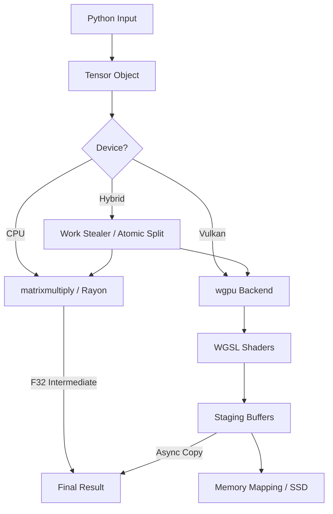

# 🏗 Architecture Deep-Dive (v3.2.0 "Valkyrie")

VNN Rusted is a "Zero-Copy" tensor engine optimized for hybrid execution across inconsistent hardware.

---

## 1. Core Data Structure: `Tensor`
*   **Location**: `src/tensor.rs:31`
*   **Design**: A `Tensor` encapsulates metadata, a `Storage` variant, and an optional memory mapping.
*   **Tri-Precision Storage**: `src/tensor.rs:23` defines the `Storage` enum:
    - `Storage::F32(Vec<f32>)`
    - `Storage::F16(Vec<half::f16>)`
    - `Storage::BF16(Vec<half::bf16>)`

### Memory Mapping (L3 Cache)
`src/tensor.rs:83` (`from_ssd`) maps binary blobs directly to the address space. It uses `libc::madvise(MADV_SEQUENTIAL)` (`src/tensor.rs:92`) to tell the Linux kernel to prefetch data from the disk controller directly into RAM, bypassing usual filesystem overhead.

---

## 2. Hybrid Execution Flow
When a MatMul `@` is triggered (`src/tensor.rs:260`):
1.  **Device Check**: If `device="hybrid"`, the engine splits the work (Default: 30% CPU / 70% GPU).
2.  **Splitting**: `src/backend.rs:360` determines the tile size based on model shape (optimized for GEMV vs MatMul).
3.  **CPU Worker**: `src/backend.rs:385` spawns a thread using `matrixmultiply::sgemm`. For F16/BF16, it performs an on-the-fly conversion to F32 intermediate (`src/backend.rs:408`) for numerical stability.
4.  **GPU Worker**: `src/backend.rs:429` orchestrates the Vulkan submission.

### Asynchronous Result Retrieval
`src/backend.rs:539` implements a staging request queue. While the GPU is computing the *next* block, the CPU is already copying the *previous* block's results from the staging buffer to the final result tensor.

---

## 3. Vulkan Pipeline & Shaders
*   **Initialization**: `src/backend.rs:28` (`init_backend`) creates the `WgpuBackend` singleton.
*   **Hardware Compatibility**: `src/backend.rs:41` detects `SHADER_F16` capabilities. If missing, the engine transparently falls back to F32 compute while keeping F16 storage.
*   **Double Buffering**: `src/backend.rs:458` uses two buffers for `B-matrix` weights to saturate PCI-e bandwidth.

---

## 4. Statistical Safety Net (Safety Hub)
VNN v3.2.0 introduces a robust statistical audit system managed in `tests/unified_benchmark.py`:
- **Median Tracking**: Filters out OS context-switch spikes.
- **StdDev (Standard Deviation)**: Measures hardware thermal stability.
- **Total Session Tracking**: Records the `total_duration_seconds` of the entire audit to analyze heat dissipation.

---

## 5. Data Flow Diagram (Mermaid)

