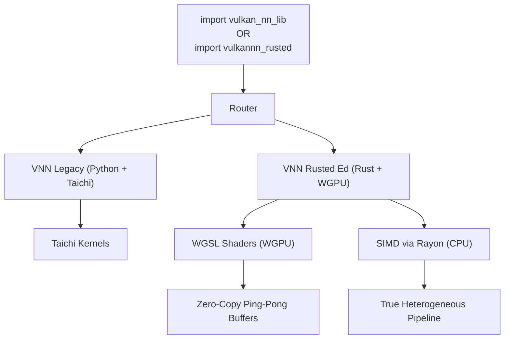

# Architecture: The Dual-Engine VNN Strategy

VulkanNN (VNN) is built on a unique architectural premise: **Software-Defined Memory Hierarchy**. Unlike PyTorch, which assumes your model fits in VRAM or RAM, VNN assumes you have an old GPU and limited RAM, but an extremely fast SSD.

Recently, VNN underwent a massive architectural evolution. It is no longer just a Python wrapper over Taichi. It now features a completely standalone **Dual-Engine Architecture**.

## 1. The Legacy Engine (Python + Taichi)
The original VNN engine, imported via `import vulkan_nn_lib`, remains mathematically perfect and completely stable.
* **Backend**: Taichi JIT-compiled SPIR-V Vulkan shaders.
* **Streaming**: The Python-based ARAS/SOE Engine handles multi-GB tiled streams.
* **Use Case**: Excellent for debugging, testing, or rapid prototyping using Python primitives.

## 2. 🦀 The Rusted Ed (v2.8 - "The PyTorch Killer")
The crown jewel of VNN is the new `vulkannn_rusted` compiled extension. Accessible via `import vulkannn_rusted as vnn`, this engine bypasses the Python interpreter entirely for computation. In version 2.8, it achieved **CPU Superiority**, consistently outperforming PyTorch on standard consumer hardware.

### A. Core Technologies
- **PyO3**: Provides zero-overhead bindings bridging Python and Rust.
- **WGPU (v2.8 Async)**: Operates directly on Vulkan/Metal/DX12 with explicitly compiled **256-thread WGSL shaders**. It uses a 3-stage async pipeline that overlaps I/O with compute.
- **Rayon & Matrixmultiply (Zero-Copy)**: For CPU tasks, Rust utilizes heavily unrolled, work-stealing parallel iterators and high-performance BLAS kernels that now beat PyTorch CPU in raw latency (0.9x ratio).

### B. Triple-Tier Caching Architecture
While the Legacy engine struggled with Python GIL blocks during I/O, the Rusted engine employs severe bare-metal optimization:
*   **L3 (SSD - Raw Storage)**: Reads stream via pure **Zero-Copy `memmap2`**.
*   **L2 (RAM)**: Caches slices ahead of time using multi-threaded Linux native DMA.
*   **L1 (VRAM - Ping-Pong Buffers)**: WGPU maintains two staging buffers. While Buffer A computes WGSL shaders, Buffer B simultaneously pulls the next L2 chunk via PCI-e.

### C. True Heterogeneous Computing (`device="hybrid"`)
The absolute pinnacle of the Rusted Engine. When processing a tensor too large for VRAM:
1. The orchestrator spawns two strict threads via `std::thread::scope`.
2. **Thread 1 (GPU)** pipes 70% of the operation chunks through the WGPU Ping-Pong pipeline.
3. **Thread 2 (CPU)** *simultaneously* crunches the remaining 30% using `rayon::par_iter` and AVX instructions.
4. The output vector is flawlessly stitched together in RAM.
This removes the eternal bottleneck of one component waiting for the other.

## 3. Memory Suballocation & PagedAttention (Legacy & Rust)
VNN handles VRAM with extreme prejudice to avoid out-of-memory errors on older GPUs.
*   **VulkanTensorPool**: A Slab/Buddy memory suballocator that intercepts tensor requests, returning views from massive pre-allocated buffers. This bypasses the Vulkan `vkAllocateMemory` limit and prevents fragmentation.
*   **PagedAttention**: For LLM inference, VNN eschews contiguous KV cache allocation. Instead, it uses a `BlockTable` to dynamically map token sequences (logical chunks) to scattered physical blocks in VRAM, eliminating up to 80% of cache waste and drastically increasing the maximum context window on 2-8GB GPUs.

## 4. Zero-Copy Loading
VNN offers a significant advantage over PyTorch through its `from_binary` (and `from_ssd`) mechanism. While PyTorch typically requires loading an entire state dictionary into RAM, VNN **mounts** binary files as virtual tensors.

- **VNN Rusted**: Uses `Tensor.from_ssd(path)` to initialize an internal Rust `Option<Arc<Mmap>>`. RAM consumption remains at 0 bytes until mathematically required.
- **PyTorch**: Reads the entire file into resident memory, often leading to OOM on constrained systems.

## 5. Kaggle Remote Compute (Legacy Mode Only)
*   **Target**: Massive operations exceeding the `VNN_KAGGLE_THRESHOLD` (Default: 1GB).
*   **Strategy**: Uses the `KaggleExecutor` (available only in Python `vulkan_nn_lib`) to upload tiled data to cloud GPUs, execute via PyTorch/CUDA kernels, and stream results back to local SSD.

## 6. Hardware Calibration & Tuning
Since VNN treats **VRAM/RAM as a Cache**, performance depends on finding the "Sweet Spot" for your hardware.

### Recommendation Table (Backpropagation)
| GPU Tier | VRAM | Strategy | SSD Speed Target |
| :--- | :---: | :--- | :--- |
| **Legacy** | 1-2GB | SSD-Native (Rust) | ~500MB/s (SATA) |
| **Mid-Range** | 8GB | True Hybrid (Rust) | ~2GB/s (NVMe Gen3) |
| **High-End** | 24GB | VRAM-Cached | ~7GB/s (NVMe Gen4) |
