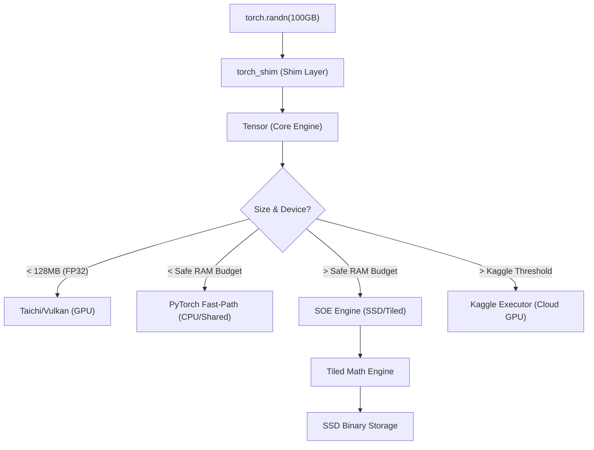

# Architecture: The VNN Bridge Strategy

VulkanNN (VNN) Legacy Edition is built on a unique architectural premise: **Software-Defined Memory Hierarchy**. Unlike PyTorch, which assumes your model fits in VRAM or RAM, VNN assumes you have an old GPU and limited RAM, but an extremely fast SSD.

## 1. The Multi-Tiered Backend
VNN automatically routes every operation through the most efficient backend based on the current system load and operation size:

### A. Vulkan (via Taichi)
*   **Target**: Small to medium tensors (under 128MB).
*   **Benefit**: Extremely low latency, full GPU acceleration.
*   **Limitation**: Limited by physical VRAM. 

### B. PyTorch Hybrid (Fast Path)
*   **Target**: Tensors that fit comfortably in RAM (below the "Safe RAM Budget").
*   **Innovation**: **Zero-Copy Shared Memory**. VNN utilizes `torch.from_numpy(self.arr)` to execute operations directly on CPU memory using PyTorch's optimized BLAS/MKL kernels.
*   **Benefit**: Extremely low overhead.
*   **Limitation**: Synchronous execution.

### C. SOE/ARAS (Streaming Operator Engine)
*   **Target**: "Monster Scale" tensors (e.g., 34GB+ on systems with limited RAM).
*   **Innovation**: **Adaptive Tiling & Backpressure**. 
    - **Adaptive Tiling**: Automatically decomposes operations into tiles that fit within a safe budget (default: 512MB).
    - **DRAS v4 Bounded Backpressure**: The engine employs a bounded prefetch queue and future-tracking to prevent SSD operations from overwhelming RAM. It monitors `MemAvailable` and dynamically throttles disk I/O when "Usage Risk" exceeds safe thresholds.
*   **SSD Native**: Results are generated directly on SSD via `memmap`, with explicit `.flush()` calls to ensure coherence between tiled writes.

### D. Kaggle Remote Compute
*   **Target**: Massive operations exceeding the `VNN_KAGGLE_THRESHOLD` (Default: 1GB).
*   **Strategy**: Uses the `KaggleExecutor` to upload tiled data to cloud GPUs, execute via PyTorch/CUDA kernels, and stream results back to local SSD. Effectively bypasses all local hardware limitations.

## 2. Memory Suballocation & PagedAttention
VNN handles VRAM with extreme prejudice to avoid out-of-memory errors on older GPUs.
*   **VulkanTensorPool**: A Slab/Buddy memory suballocator that intercepts tensor requests, returning views from massive pre-allocated buffers. This bypasses the Vulkan `vkAllocateMemory` limit and prevents fragmentation.
*   **PagedAttention (Phase 2)**: For LLM inference, VNN eschews contiguous KV cache allocation. Instead, it uses a `BlockTable` to dynamically map token sequences (logical chunks) to scattered physical blocks in VRAM, eliminating up to 80% of cache waste and drastically increasing the maximum context window on 2-8GB GPUs.

## 3. Autograd & Unified Gradient Accumulation
VNN's reverse-mode differentiation engine is backend-agnostic. The core innovation lies in the `_acc_grad(grad)` method, which intelligently routes gradient accumulation based on the host device:

- **SSD**: Employs the SOE/ARAS engine for multi-threaded, tiled element-wise addition directly on disk.
- **Kaggle**: (Planned/Experimental) Offloads accumulation steps for massive layers.
- **Vulkan**: Uses Taichi kernels for GPU-accelerated accumulation.
- **CPU**: Utilizes optimized PyTorch shared memory paths for maximum performance.

This guarantees that even with a 40GB gradient buffer on an 8GB RAM system, accumulation will not trigger an Out-of-Memory (OOM) error.

## 4. Zero-Copy Loading
VNN offers a significant advantage over PyTorch through its `from_binary` (and `external_path`) mechanism. While PyTorch typically requires loading an entire state dictionary into RAM, VNN **mounts** binary files as virtual tensors.

- **VNN**: Maps the file on disk via `memmap`. RAM consumption remains minimal until computation begins.
- **PyTorch**: Reads the entire file into resident memory, often leading to OOM on constrained systems.

## 5. Compute Kernels & Taichi Backend
Computationally intensive tasks are handled by **Taichi kernels**, which are JIT-compiled to SPIR-V (Vulkan compute shaders).
- **Design**: Kernels operate on flattened 1D arrays to streamline shader logic.
- **Parallelization**: Efficiently managed by the Taichi runtime.
- **Precision**: Highly optimized for FP32, with expanding support for FP16 and INT8.

## 6. Hardware Calibration & Tuning
Since VNN treats **VRAM/RAM as a Cache**, performance depends on finding the "Sweet Spot" for your hardware.

### The "Fast BAR" Threshold
Most GPUs have a Visible VRAM BAR (usually 256MB). 
- **Optimization**: Set your optimizer `tile_size` so that state buffers fit into this 256MB window for full-speed CPU access.

### Recommendation Table (Backpropagation)
| GPU Tier | VRAM | Strategy | SSD Speed Target |
| :--- | :---: | :--- | :--- |
| **Legacy** | 1-2GB | SSD-Native | ~500MB/s (SATA) |
| **Mid-Range** | 8GB | Hybrid Buffer | ~2GB/s (NVMe Gen3) |
| **High-End** | 24GB | VRAM-Cached | ~7GB/s (NVMe Gen4) |
