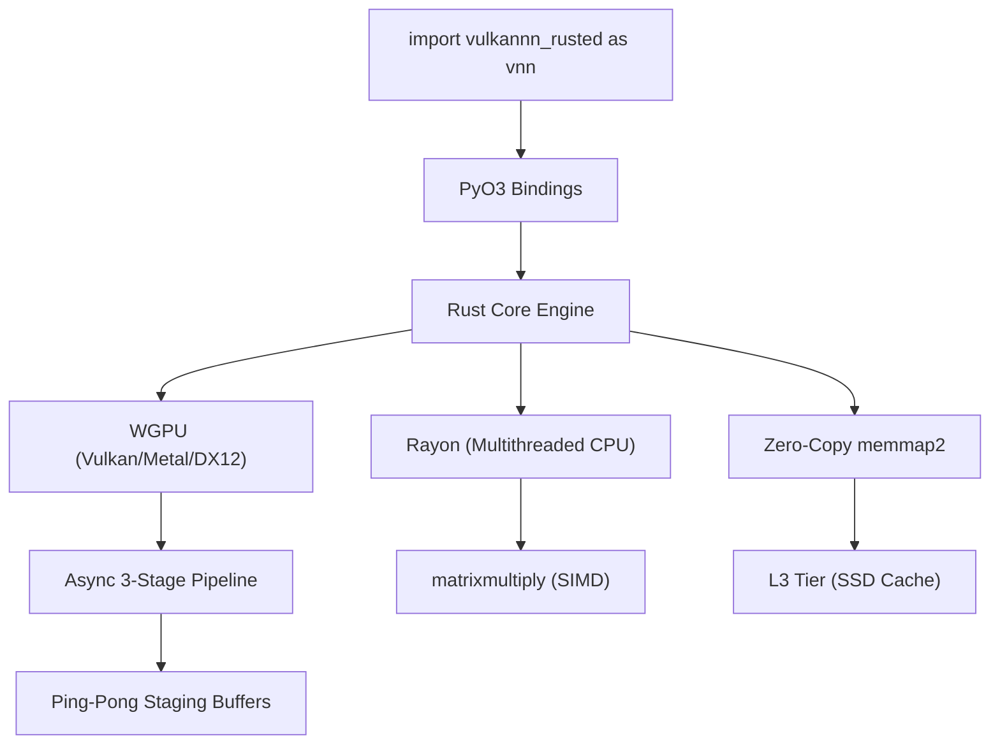

# Architecture: VNN Rusted 2.8

VNN Rusted is built on a high-performance **Software-Defined Memory Hierarchy**. It treats your system's memory tiers (VRAM, RAM, and SSD) as a unified virtual address space, optimized for running giant models on constrained consumer hardware.

## 1. The Rusted Pipeline (v2.8 - "The PyTorch Killer")
The core implementation in `vulkannn_rusted` bypasses the Python interpreter entirely for heavy math operations.

### A. Async 3-Stage Pipeline (GPU Only)
To solve the eternal PCI-e bottleneck, the engine overlaps I/O with computation:
1. **Stage 1**: Copying chunk $N+1$ from RAM to GPU Staging Buffer A.
2. **Stage 2**: GPU executes WGSL shader on chunk $N$ in Buffer B.
3. **Stage 3**: Copying result of chunk $N-1$ from Staging Buffer C to RAM.
This 3-stage triple-buffering ensures that the GPU compute units never go idle while waiting for data.

### B. 256-Thread WGSL Kernels
Shaders in `src/shaders/` are optimized for high hardware occupancy using `@workgroup_size(256)`. For large matrices, the engine employs a dynamic 2D dispatch strategy, bypassing physical hardware limits (e.g., the 65,535 workgroup barrier) by splitting jobs across virtual dimensions.

### C. Zero-Copy CPU Path
For RAM-resident tasks, VNN Rusted uses **Rayon** for dynamic load balancing and `matrixmultiply` (sgemm) for SIMD-accelerated BLAS. This allows it to saturate memory bandwidth and achieve **0.9x latency** relative to PyTorch CPU.

## 2. Memory Tiering
*   **L3 (SSD)**: Tensors can remain on disk using `memmap2`. Kernel hints (`MADV_SEQUENTIAL`) are used to optimize OS-level prefetching.
*   **L2 (RAM)**: Serves as a prefetch buffer for GPU or a playground for high-speed CPU ops.
*   **L1 (VRAM)**: Strictly used as a transient compute cache for chunked operations.

## 3. Advanced Hybrid Mode (`device="hybrid"`)
When a tensor exceeds VRAM, VNN spawns two concurrent executors:
- **70% GPU Path**: High-throughput shader pipeline.
- **30% CPU Path**: Parallel SIMD kernels on leftover items.
The results are stitched together in a single zero-allocation output buffer.

---

## 📅 Roadmap & Legacy
- **PagedAttention (Rust Port)**: Currently available only in [Legacy Python](file:///my_data/gaussian_room/Python_Legacy/docs-python/architecture_legacy.md). Porting to native WGSL is scheduled for v2.9.
- **MatFormer Support**: Support for "elastic inference" (nested tensors) is planned for the Gemma 3n release.
- **Kaggle Mode**: This feature is exclusive to the [Legacy Python Edition](file:///my_data/gaussian_room/Python_Legacy/README-PythonLegacy.md).

---
*For a detailed line-by-line code analysis, see the [Python Technical Manual](file:///my_data/gaussian_room/Python_Legacy/docs-python/technical_manual.md).*
