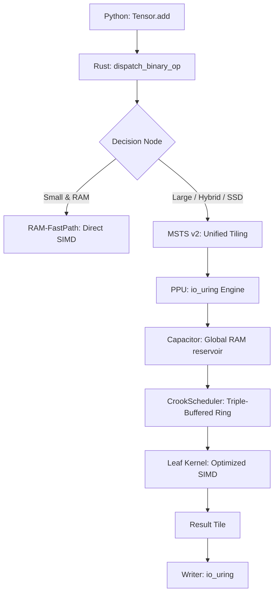

# OxTorch Unified Architecture (v3.8.1-rc)

This document describes the **Final Unified Architecture** of the OxTorch core. It follows the "MERA-Style" philosophy of decoupling I/O, storage management, and computation into a single, high-performance pipeline.

---

## 1. The Unified High-Level Pipeline

In the new architecture, there is only ONE entry point for all CPU operations. The system dynamically selects the most efficient path for the given tensor size and hardware.

```mermaid
graph TD
    A[Python: Tensor.add] --> B[Rust: dispatch_binary_op]
    B --> C{Decision Node}
    C -->|Small & RAM| D[RAM-FastPath: Direct SIMD]
    C -->|Large / Hybrid / SSD| F[MSTS v2: Unified Tiling]
    
    F --> G[PPU: io_uring Engine]
    G --> H[Capacitor: Global RAM reservoir]
    H --> I[CrookScheduler: Triple-Buffered Ring]
    I --> J[Leaf Kernel: Optimized SIMD]
    J --> K[Result Tile]
    K --> L[Writer: io_uring]
```

## 2. Component Roles

### A. Capacitor (The Reservoir)
- **Status**: Allocated up to 50% of available system RAM (with a 25% safety floor).
- **Role**: The landing zone for all SSD I/O. It uses `O_DIRECT` and `io_uring` to perform zero-copy DMA from the NVMe controller.
- **Benefit**: Aggressive prefetching via Parallel-Async-Reader (PAR) makes the SSD feel as fast as RAM for sequential workloads.

### B. CrookScheduler (The Manager)
- **Status**: Ring-based orchestrator.
- **Role**: Manages a circular ring of **StatefulTiles**. Each tile implements a **Multi-Stream Handshake** (`ready_bits`) to coordinate multiple sources.
- **Integration**: Decouples the **Reader Worker**, **Compute Worker**, and **Write Worker** into separate threads, overlapping I/O and compute entirely.

### C. MSTS v2 (The Brain)
- **Role**: Master orchestrator. Determines the tiling strategy (`TILE_LARGE` vs `TILE_SMALL`) and ring depth (`RING_LARGE`) based on build-time hardware discovery (L2/L3 cache sizes).
- **Unification**: Handles both Unary and Binary operations through a standardized `execute_op_unified` loop.

### D. Leaf Kernels (The Bricks)
- **Role**: Optimized SIMD functions with auto-dispatch (AVX2 -> AVX1 -> SSE2 -> NEON).
- **Constraint**: Purely serial/parallel SIMD; no nested threading.
- **Numerical Parity**: Uses `f64` accumulation for reductions (Sum/Mean) to achieve 100% parity with PyTorch.

---

## 3. Data Flow: The "Jerry Can" Analogy

1.  **Dysk (Source)**: The distant quarry.
2.  **Capacitor**: The huge reservoir next to the building site (up to 50% RAM). **io_uring** is the high-speed pipeline filling it.
3.  **Crook Ring**: The standardized jerry cans (Tiles). Always **4096-byte aligned** for direct hardware access.
4.  **MSTS**: The logistics manager filling jerry cans from the reservoir and handing them to the builders.
5.  **Leaf Kernels**: The builders. They perform the computation (SIMD) on the content of the jerry cans.

This architecture ensures that the **Builders (CPU)** are never waiting for the **Pipes (SSD)**, thanks to the **Reservoir (Capacitor)**.
