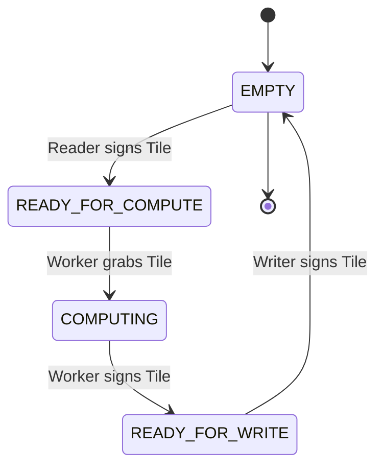
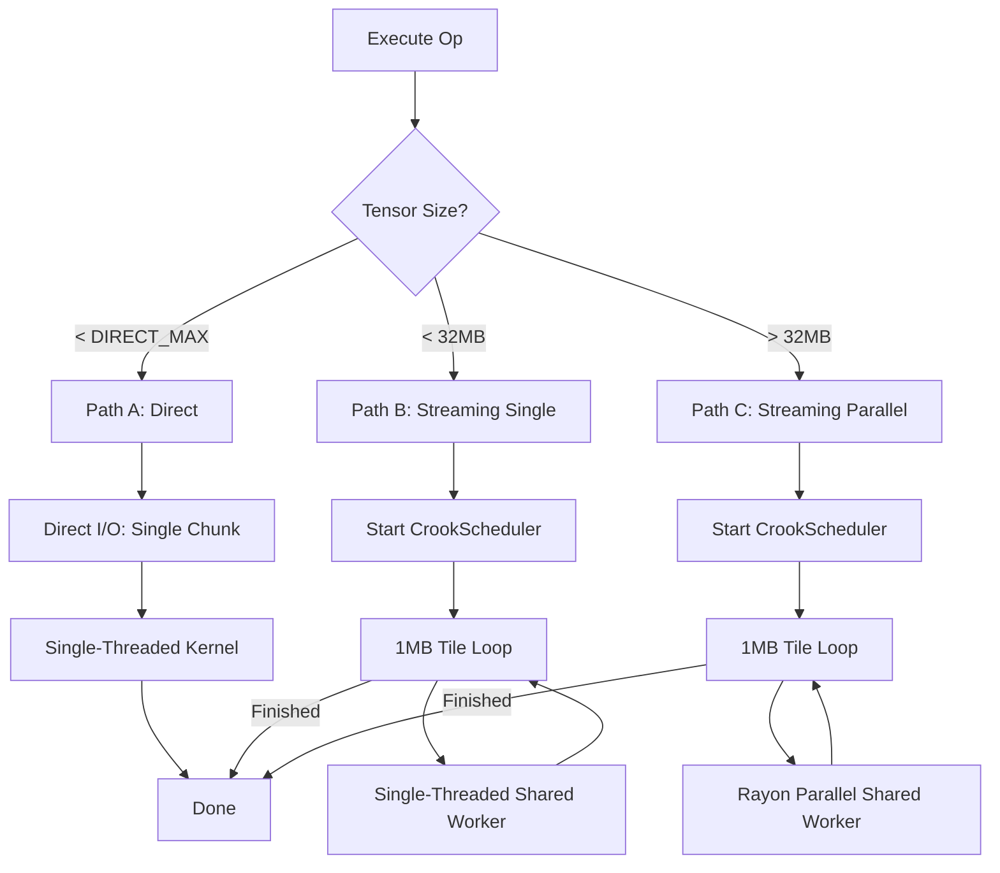
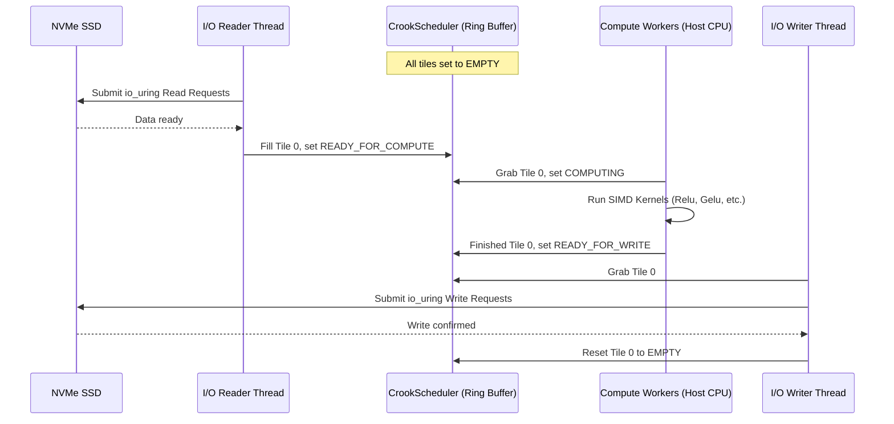

# MSTS State Machine & Internal Visualization

The **Multi-Stage Tensor Streaming (MSTS)** system is the heart of OxTorch's performance on massive datasets. It coordinates asynchronous I/O with high-throughput compute.

## State Machine Visualization

Each **Tile** (typically 1MB) in the `CrookScheduler`'s ring buffer follows a strict lifecycle. This ensures that the Reader, Worker, and Writer never access the same memory concurrently.

### State Definitions
| State | Responsibility | Description |
| :--- | :--- | :--- |
| `EMPTY` | **Reader** | The tile is a clean slate, waiting for data from the SSD. |
| `READY_FOR_COMPUTE` | **Worker** | The tile contains valid input data, waiting for the CPU/GPU kernel. |
| `COMPUTING` | **Worker** | The kernel is actively processing the tile's data. |
| `READY_FOR_WRITE` | **Writer** | The results are ready in the tile, waiting to be streamed back to disk. |

---

## The 3-Path Dispatch Strategy

To maximize performance across all tensor sizes, MSTS dynamically chooses the most efficient execution path at runtime.

---

## Component Interaction Overview

The following diagram shows how the Host threads interact with the SSD using `io_uring` and the `CrookScheduler`.

## Related Documentation
- [MSTS Logic](msts_logic.md): Theoretical background.
- [SSD Format](ssd_format.md): Binary structure of the data.
- [CPU Backend](cpu_backend.md): Details on the SIMD kernels used by the Workers.
